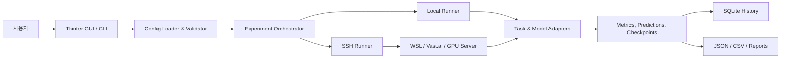

# IronFlow Model_LAB

로컬 PC에서 비전 모델 실험을 설계하고, 로컬·WSL·원격 GPU/Vast.ai 환경에서 실행·추적·수집하기 위한 실험 플랫폼입니다.

IronFlow Model_LAB은 모델 학습 코드 하나만 제공하는 프로젝트가 아닙니다. 데이터 준비, 모델 및 증강 조합 설정, 실행 전 검증, SSH 원격 실행, 상태 확인, 결과 회수와 비교까지 하나의 설정 기반 흐름으로 관리하는 것을 목표로 합니다.

> 이 저장소는 **소스 코드 저장소**입니다. 사전학습 모델, 데이터셋, 실험 결과, SSH 개인키와 실제 서버 접속 정보는 포함하지 않습니다. 사전학습 모델까지 포함된 실행용 패키지는 GitHub **Releases**의 휴대용 배포본을 사용하세요.

## 목차

- [프로젝트 개요](#프로젝트-개요)
- [현재 상태](#현재-상태)
- [주요 기능](#주요-기능)
- [실행 구조](#실행-구조)
- [빠른 시작](#빠른-시작)
- [소스 저장소 설치](#소스-저장소-설치)
- [GUI 사용 흐름](#gui-사용-흐름)
- [CLI 사용 예시](#cli-사용-예시)
- [모델 카탈로그](#모델-카탈로그)
- [설정 파일](#설정-파일)
- [데이터셋 준비](#데이터셋-준비)
- [원격 GPU와 Vast.ai 실행](#원격-gpu와-vastai-실행)
- [실험 결과와 재현성](#실험-결과와-재현성)
- [저장소 구조](#저장소-구조)
- [보안 및 Git 관리](#보안-및-git-관리)
- [문제 해결](#문제-해결)
- [관련 문서](#관련-문서)
- [라이선스](#라이선스)

## 프로젝트 개요

비전 실험은 모델만 바꾸는 작업으로 끝나지 않습니다. 데이터 분할, 전처리, augmentation, checkpoint, 실행 장비, 평가 지표와 산출물 형식이 함께 관리되어야 결과를 비교하고 재현할 수 있습니다.

IronFlow Model_LAB은 다음 원칙을 중심으로 구성되어 있습니다.

1. **설정 기반 실행**: 실험 조건을 YAML/JSON으로 남깁니다.
2. **모델 adapter 분리**: 모델별 차이를 공통 실행 흐름과 분리합니다.
3. **로컬 우선 검증**: 작은 smoke test를 통과한 뒤 원격 GPU 실행으로 확장합니다.
4. **단계별 원격 실행**: 준비, 업로드, 실행, 상태 확인, 다운로드와 수집 단계를 분리합니다.
5. **표준 산출물**: JSON, CSV, 로그, metric과 artifact를 실험 단위로 관리합니다.
6. **추적 가능한 이력**: SQLite와 `experiment_id`를 이용해 실행 상태를 기록합니다.

## 현재 상태

이 저장소는 `Model_LAB_portable_20260715` 스냅샷을 기준으로 정리되어 있습니다.

| 구분 | 상태 |
|---|---|
| 로컬 GUI | Tkinter 기반 실행 화면 제공 |
| 로컬 실행 | config 기반 local runner 및 smoke 흐름 제공 |
| 원격 실행 | SSH 준비·bootstrap·upload·submit·status·logs·collect 흐름 제공 |
| 실행 이력 | SQLite 기반 실험·서버·스케줄 기록 |
| 모델 카탈로그 | 80개 항목: detection 21, tracking 10, classification 17, segmentation 21, embedding 11 |
| 실행 검증 상태 | `validated` 2, `adapter_ready` 27, `prepared` 51 |
| 코드 저장소 용량 | 모델 가중치를 제외한 수 MB 규모 |

모델 카탈로그에 등록되어 있다는 사실이 해당 모델의 전체 학습·추론 품질을 보장하지는 않습니다. 각 항목의 `readiness_status`를 반드시 확인하세요.

- `validated`: 현재 adapter와 artifact 흐름에서 smoke 검증된 항목
- `adapter_ready`: adapter 연결은 준비됐지만 실제 환경·가중치 검증이 추가로 필요한 항목
- `prepared`: 카탈로그와 계약이 준비된 후보로, 구현 또는 실행 검증이 더 필요한 항목

## 주요 기능

### 실험 구성

- detection, classification, segmentation, tracking, embedding 작업 카탈로그
- 모델, 데이터, preprocessing, augmentation, runtime과 export 옵션을 설정 파일로 관리
- 모델·작업 조합의 compatibility 검증
- 중복 `experiment_id` 방지 및 명시적인 교체 실행
- 예약 실행 등록과 scheduler 실행

### 실행 환경

- 로컬 mock 및 CPU/GPU 실행 흐름
- WSL Ubuntu SSH 계약 검증용 구성
- Vast.ai 등 Linux GPU 서버 프로필
- 원격 서버 SSH 연결, GPU와 Python 의존성 preflight
- background submit 이후 상태·로그 확인 및 결과 수집

### 결과 관리

- 실험별 상태와 메타데이터 저장
- prediction, metric, checkpoint와 중간 artifact 관리
- JSON/CSV 기반 결과 내보내기
- 여러 실험의 best metric 비교
- 시각 보고서 생성과 후처리 스크립트

## 실행 구조



원격 실험은 다음 단계로 진행됩니다.

```text
prepare
  -> bootstrap
  -> upload
  -> submit/run
  -> status/logs
  -> download
  -> collect
```

각 단계를 분리해 네트워크 오류나 서버 중단이 발생했을 때 전체 과정을 처음부터 다시 실행하지 않고 문제 지점을 확인할 수 있습니다.

## 빠른 시작

처음 사용하는 경우에는 사전학습 모델과 실행 스크립트가 함께 들어 있는 Release 배포본이 가장 간단합니다.

1. GitHub 저장소의 **Releases**에서 `Model_LAB_portable_20260715.zip`과 `.sha256` 파일을 내려받습니다.
2. ZIP을 `D:\Model_LAB`처럼 짧은 영문 경로에 압축 해제합니다.
3. 아래 순서대로 실행합니다.

```powershell
.\setup_first.bat
.\run_gui.bat --check
.\run_gui.bat
```

4. 데이터셋과 SSH 키는 사용자 환경에서 별도로 준비합니다.

전체 절차는 [처음 실행 및 Vast.ai 실험 가이드](docs/README_FIRST_RUN_KO.md)를 참고하세요.

## 소스 저장소 설치

### 요구 환경

- Windows 10/11
- Python 3.12 권장
- Git
- 원격 실행 시 OpenSSH client와 SSH 개인키
- NVIDIA GPU 작업 시 해당 장비와 호환되는 CUDA/PyTorch 환경

### 저장소 복제

```powershell
git clone https://github.com/qwertttyy/ironflow-model-lab.git
cd ironflow-model-lab
```

### 자동 설치

```powershell
.\setup.bat
```

`setup.bat`은 Conda가 있으면 `IRONFLOW_VISION` 환경을 사용하고, 그렇지 않으면 프로젝트의 `.venv`를 구성합니다. 기본 Python 버전은 3.12이며 다음 optional dependency 그룹을 설치합니다.

```text
test, classification, timm, yolo, augmentation
```

### 설치 확인과 GUI 실행

```powershell
.\run_gui.bat --check
.\run_gui.bat
```

`--check`는 GUI를 열기 전에 Python 환경과 주요 import 상태를 확인할 때 사용합니다.

### 수동 환경 활성화

Conda를 사용한 경우:

```powershell
conda activate IRONFLOW_VISION
```

프로젝트 `.venv`를 사용한 경우:

```powershell
.\.venv\Scripts\Activate.ps1
```

## GUI 사용 흐름

1. `run_gui.bat`으로 GUI를 실행합니다.
2. 데이터셋 또는 복원된 prepared dataset 경로를 확인합니다.
3. 작업 유형과 모델을 선택합니다.
4. preprocessing과 augmentation 정책을 선택합니다.
5. local 또는 SSH/Vast 실행 환경을 선택합니다.
6. 실행 전 readiness와 경로 검사를 수행합니다.
7. 실험을 queue에 추가하고 실행합니다.
8. Status와 Logs에서 진행 상태를 확인합니다.
9. 완료 후 Collect로 metric과 artifact를 회수합니다.
10. Result Compare와 보고서 도구로 여러 실험을 비교합니다.

실제 데이터와 서버 설정은 저장소에 포함되지 않으므로 최초 실행 전 사용자 환경에 맞게 입력해야 합니다.

## CLI 사용 예시

환경을 활성화한 뒤 `ironflow-engine` 명령을 사용할 수 있습니다.

### 로컬 실험 실행

```powershell
ironflow-engine run --config configs/engine/local_mock.yaml
```

명시적인 실험 ID를 지정할 수도 있습니다.

```powershell
ironflow-engine run `
  --config configs/engine/local_mock.yaml `
  --experiment-id local-smoke-001
```

이미 존재하는 ID를 의도적으로 다시 사용할 때만 `--replace-existing`을 추가하세요.

### 상태·로그·결과 확인

```powershell
ironflow-engine list
ironflow-engine status local-smoke-001
ironflow-engine logs local-smoke-001 --tail 100
ironflow-engine collect local-smoke-001
ironflow-engine compare
```

### 서버 프로필 등록과 점검

먼저 `configs/servers/vast_manual_template.yaml`을 복사해 사용자 전용 설정을 만들고 실제 접속 정보를 입력합니다. 실제 프로필은 Git에 커밋하지 마세요.

```powershell
ironflow-engine server add `
  --config configs/servers/my_vast_server.yaml `
  --check-paths

ironflow-engine server check my-vast `
  --live-ssh `
  --gpu-probe

ironflow-engine server preflight my-vast
```

### SSH 전체 흐름 실행

```powershell
ironflow-engine ssh execute `
  --config configs/engine/ssh_gpu_mock_smoke_template.yaml `
  --server my-vast `
  --experiment-id vast-smoke-001
```

단계별 실행이 필요하면 `prepare`, `bootstrap`, `upload`, `submit`, `status`, `logs`, `download`, `collect` 명령을 사용할 수 있습니다.

```powershell
ironflow-engine ssh prepare `
  --config configs/engine/ssh_gpu_mock_smoke_template.yaml `
  --server my-vast `
  --experiment-id vast-smoke-002

ironflow-engine ssh bootstrap vast-smoke-002
ironflow-engine ssh upload vast-smoke-002
ironflow-engine ssh submit vast-smoke-002
ironflow-engine ssh status vast-smoke-002
ironflow-engine ssh logs vast-smoke-002 --tail 100
ironflow-engine ssh collect vast-smoke-002
```

## 모델 카탈로그

기본 모델 정의는 [`configs/model_catalog/default_model_catalog.yaml`](configs/model_catalog/default_model_catalog.yaml)에 있습니다.

| 작업 | 등록 수 | 예시 |
|---|---:|---|
| Detection | 21 | YOLO11/12/26, YOLOv8, RF-DETR, D-FINE, RT-DETR |
| Tracking | 10 | ByteTrack, BoT-SORT, OC-SORT, DeepSORT |
| Classification | 17 | MobileNetV3, EfficientNet, ResNet, ConvNeXt, ViT, Swin |
| Segmentation | 21 | YOLO Seg, SAM 계열, FastSAM, Grounded SAM |
| Embedding | 11 | DINOv2/3, CLIP, OpenCLIP, SigLIP2 |

각 모델 항목에는 다음 정보가 포함됩니다.

- `task`, `model_id`, `display_name`
- `adapter_key`, `adapter_type`, `family`
- `supports_train`, `supports_predict`
- `runtime_targets`
- 입력·출력 artifact 계약
- 필요한 dependency
- `implementation_status`, `readiness_status`

새 모델을 사용할 때는 표시 이름보다 `adapter_key`, checkpoint 경로와 readiness 상태를 우선 확인하세요.

## 설정 파일

주요 설정 위치는 다음과 같습니다.

```text
configs/engine/          실행 가능한 실험 설정과 smoke template
configs/model_catalog/   모델 및 adapter 카탈로그
configs/native_params/   모델별 native parameter 기본값
configs/presets/         재사용 가능한 preset
configs/servers/         로컬·WSL·Vast 서버 profile template
configs/templates/       새 설정 작성을 위한 기본 template
```

설정 파일에는 데이터 경로, 모델 선택, 실행 장비, 학습 parameter, artifact 저장 위치가 함께 들어갈 수 있습니다. 팀 실험에서는 설정 파일과 실제 결과를 동일한 `experiment_id`로 연결하는 것을 권장합니다.

## 데이터셋 준비

데이터셋은 저장소에 포함하지 않습니다. 로컬 또는 원격 작업 폴더에 별도로 복원해야 합니다.

Google Drive 관련 문서와 스크립트에는 실제 공유 주소 대신 다음과 같은 placeholder가 들어 있습니다.

```text
YOUR_SOURCE_DATASET_FOLDER_ID
YOUR_TEAM_DATASET_FOLDER_ID
YOUR_PREPARED_DATASET_FOLDER_ID
YOUR_EXPERIMENT_RESULTS_FOLDER_ID
YOUR_RELEASE_FOLDER_ID
```

사용 시 자신의 Google Drive 폴더 ID 또는 명령행 인자로 교체하세요. 실제 공유 링크를 소스 코드에 커밋하지 마세요.

데이터 준비 시 다음 원칙을 지킵니다.

- 원본 데이터와 변환 데이터를 분리합니다.
- 동일 이미지 또는 동일 객체가 train/validation/test에 섞이지 않게 split 기준을 유지합니다.
- 생성된 manifest와 class mapping을 함께 보관합니다.
- 압축 파일과 배포본은 SHA-256으로 검증합니다.
- 사용자 이미지와 비공개 annotation은 Git에 포함하지 않습니다.

## 원격 GPU와 Vast.ai 실행

원격 실행 전 다음 항목을 준비해야 합니다.

- 실행 중인 GPU 인스턴스
- SSH host, port와 user
- 로컬 SSH 개인키 경로
- 서버에 등록한 공개키
- 원격 workspace 경로
- 데이터셋과 checkpoint 위치
- CUDA, PyTorch와 모델별 dependency

권장 확인 순서:

1. 제공된 SSH 명령으로 직접 접속합니다.
2. `server check --live-ssh`로 IronFlow 연결을 확인합니다.
3. `--gpu-probe` 또는 `server preflight`로 GPU를 확인합니다.
4. 짧은 smoke config를 실행합니다.
5. 로그와 artifact 회수가 정상인지 확인합니다.
6. 이후에 전체 학습을 시작합니다.

Vast.ai 인스턴스 비용은 인스턴스를 종료할 때까지 발생할 수 있습니다. 결과 다운로드와 수집을 완료한 뒤 인스턴스 종료 여부를 반드시 확인하세요.

## 실험 결과와 재현성

`runs/`는 로컬 실행 데이터가 저장되는 기본 영역이며 Git에서 제외됩니다.

```text
runs/w/               작업 실행 영역
runs/e/               실험 결과 영역
runs/user_datasets/   사용자 데이터셋 영역
runs/pytest_tmp/      테스트 임시 영역
```

재현 가능한 비교를 위해 최소한 다음 항목을 함께 보관하세요.

- 사용한 engine config 원본
- `experiment_id`
- 데이터셋 manifest와 split 정보
- 모델 ID와 checkpoint checksum
- Python/PyTorch/CUDA 버전
- random seed
- metric JSON/CSV와 로그
- 실패한 실행의 오류 메시지

## 저장소 구조

```text
ironflow-model-lab/
├─ configs/                    실험·모델·서버 설정
├─ docs/                       운영·모델·데이터 문서
├─ models/
│  └─ checkpoints/pretrained/  가중치 위치(실제 파일은 Git 제외)
├─ runs/                       실행 결과(내용은 Git 제외)
├─ scripts/                    데이터·배포·원격 실행 보조 도구
├─ src/ironflow_exp/
│  ├─ configs/                 config load 및 validation
│  ├─ domain/                  공통 domain record
│  ├─ models/                  모델 adapter와 registry
│  ├─ pipelines/               detection/classification pipeline
│  ├─ exporters/               JSON/CSV export
│  └─ engine/
│     ├─ cli/                  `ironflow-engine` CLI
│     ├─ runners/              local/SSH runner
│     ├─ scheduler/            예약 실행
│     ├─ server/               SSH·GPU·dependency 관리
│     ├─ storage/              SQLite 저장소
│     ├─ tasks/                task adapter와 실행기
│     └─ ui/                   Tkinter GUI
├─ pyproject.toml              패키지와 dependency 정의
├─ setup.bat                   소스 저장소 설치
├─ run_gui.bat                 GUI 실행 및 환경 점검
├─ SECURITY.md                 보안 제보 안내
├─ .gitignore                  비공개·대용량·생성 파일 제외 규칙
└─ .gitattributes              줄바꿈과 바이너리 파일 규칙
```

## 보안 및 Git 관리

다음 항목은 절대 커밋하지 않습니다.

- `.env`, API key와 access token
- SSH 개인키 (`*.pem`, `*.key`, `id_rsa*`, `id_ed25519*`)
- 실제 서버 host, port와 사용자별 profile
- Google Drive 실제 공유 폴더 ID
- 데이터셋과 사용자 이미지
- `.pt`, `.pth`, `.ckpt`, `.onnx`, `.safetensors` 가중치
- SQLite 이력, 로그와 실험 산출물
- `.venv`, Python cache와 IDE 개인 설정

커밋 전 확인:

```powershell
git status
git diff
git diff --cached
```

대용량 모델 파일은 Git 저장소가 아니라 Release 배포본 또는 별도의 artifact storage로 관리합니다.

## 문제 해결

### GUI가 실행되지 않음

```powershell
.\run_gui.bat --check
```

Python 3.12 환경과 필수 package import 결과를 먼저 확인하세요. 문제가 계속되면 `setup.bat --force`로 dependency 설치를 다시 실행할 수 있습니다.

### 모델 checkpoint를 찾지 못함

소스 저장소에는 가중치가 없습니다. Release 배포본을 사용하거나 `scripts/download_pretrained_weights.py` 등 제공된 준비 스크립트로 가중치를 내려받아 설정 경로와 일치시키세요.

### `Permission denied (publickey)`

- GUI 또는 server profile의 개인키 경로 확인
- Vast.ai에 공개키가 등록됐는지 확인
- SSH 명령의 port와 user 확인
- 같은 키를 명시해 수동 SSH 접속 확인

### `Connection refused` 또는 timeout

인스턴스가 실행 중인지, Direct SSH port가 바뀌지 않았는지, 방화벽과 네트워크 상태가 정상인지 확인하세요.

### Google Drive 다운로드 실패

저장소의 URL은 placeholder입니다. 자신의 공유 폴더 ID로 교체했는지, 링크 권한과 `gdown` 접근이 가능한지 확인하세요.

### 원격 dependency 부족

먼저 설치 계획만 확인한 뒤 필요할 때 실행하세요.

```powershell
ironflow-engine server install-deps my-vast
ironflow-engine server install-deps my-vast --execute
```

### 기존 실험 ID 충돌

기존 기록을 보존하는 것이 기본 동작입니다. 정말 같은 ID를 재사용하려는 경우에만 `--replace-existing`을 지정하세요.

## 관련 문서

- [처음 실행 및 Vast.ai 실험 가이드](docs/README_FIRST_RUN_KO.md)
- [휴대용 배포본 구성 안내](docs/DISTRIBUTION_GUIDE_KO.md)
- [현재 프로그램 구조](docs/current_program_structure_ko.md)
- [프로그램 상세 설명](docs/ironflow_program_detailed_description_ko.md)
- [모델 아키텍처와 코드](docs/model_architecture_and_code_ko.md)
- [모델 weight/checkpoint 정책](docs/model_weight_checkpoint_policy_ko.md)
- [모델별 hyperparameter 정책](docs/model_family_hyperparameter_policy_ko.md)
- [최종 모델 선정 실험 계획](docs/final_model_selection_experiment_plan_ko.md)
- [팀 최초 실행 가이드](docs/team_first_run_guide_ko.md)
- [팀 학습 사용자 매뉴얼](docs/team_training_user_manual_ko.md)
- [데이터셋 준비 가이드](docs/tank_armor_dataset_prepare_guide_ko.md)
- [Vast 데이터 다운로드 명령](docs/vast_dataset_download_commands_ko.md)
- [시각 보고서 후처리](docs/visual_report_postprocess_guide_ko.md)

## 라이선스

현재 이 저장소에는 명시적인 오픈소스 라이선스가 부여되지 않았습니다. 모든 권리는 저작권자에게 있으며 별도 허가 없이 복제, 수정 또는 재배포할 수 없습니다.

사전학습 모델, 외부 프레임워크와 데이터셋에는 각각의 원저작자 라이선스 및 이용 조건이 별도로 적용될 수 있습니다.
